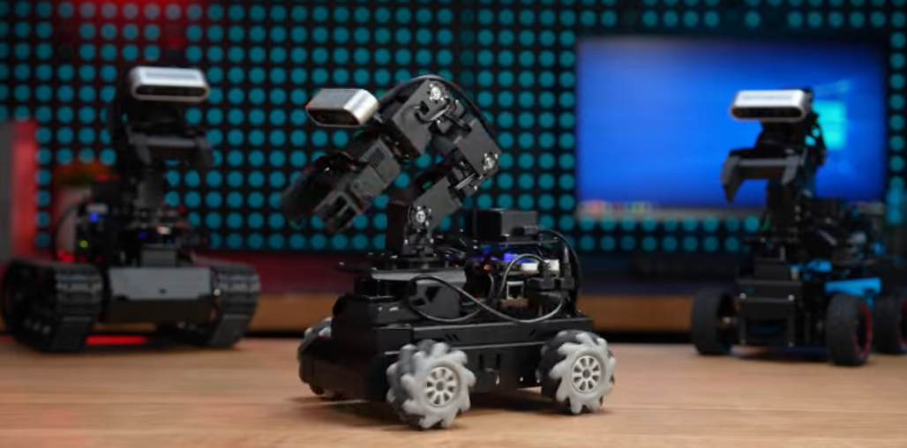
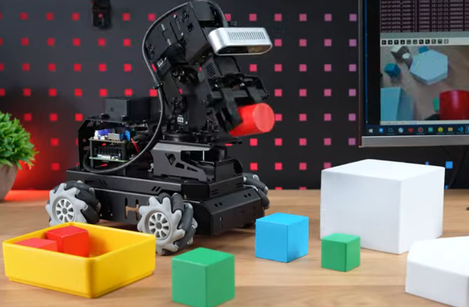
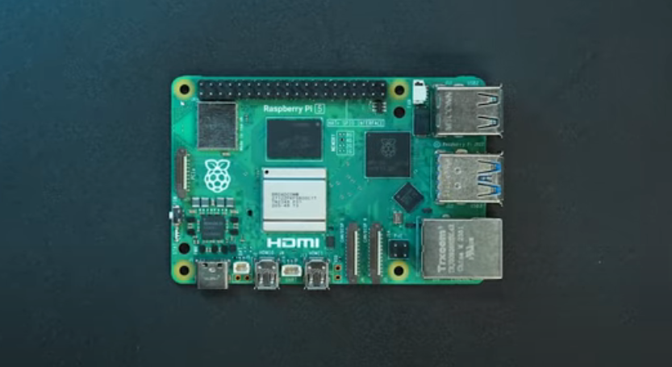
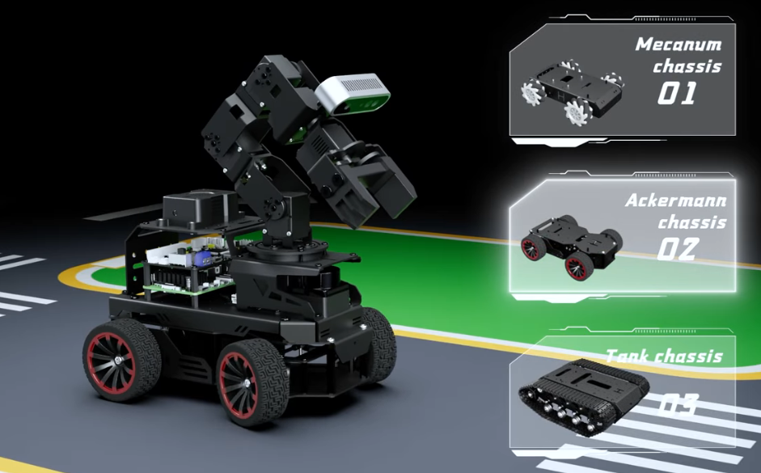
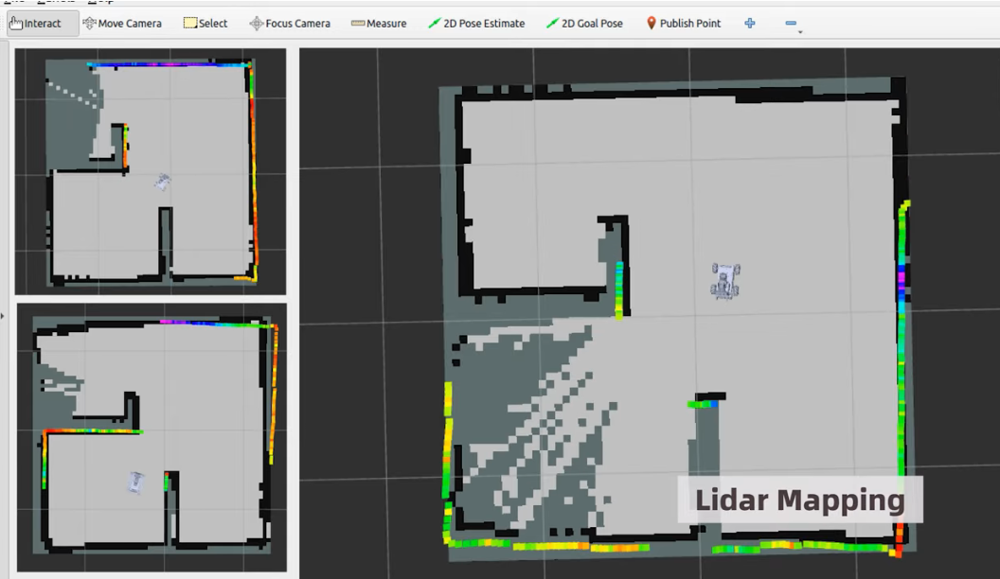
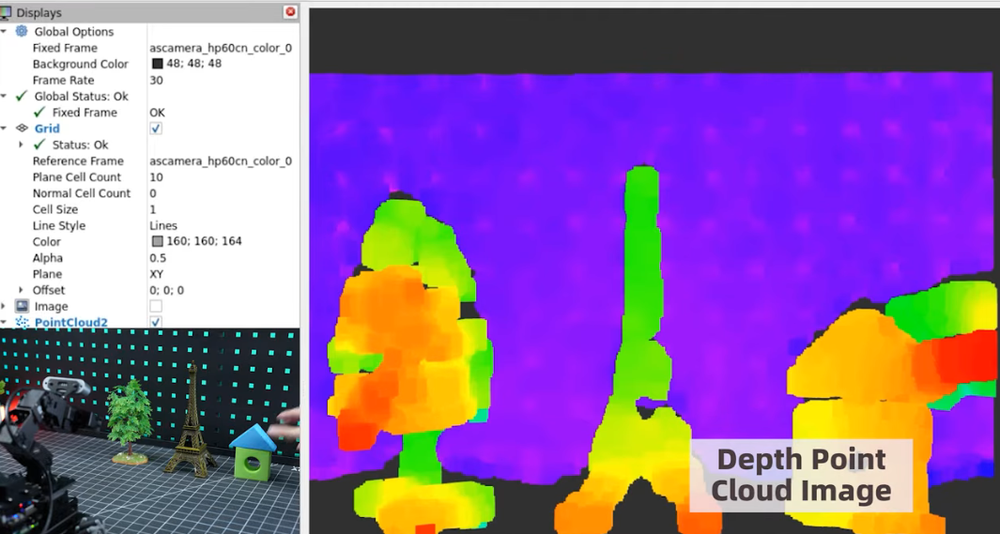
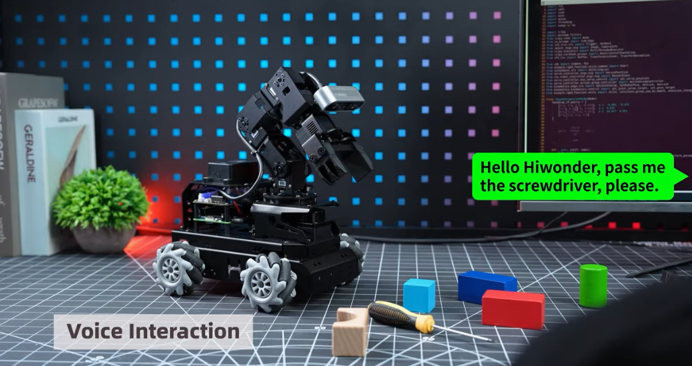
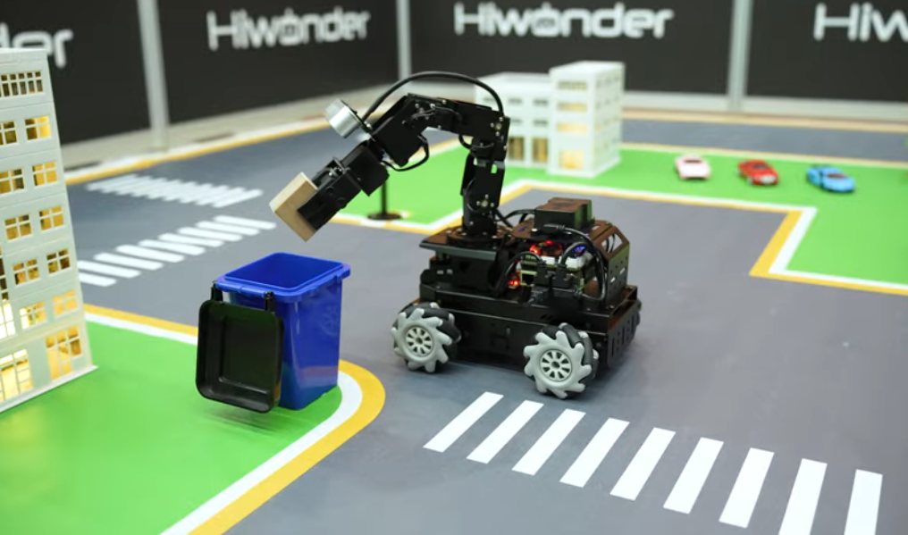
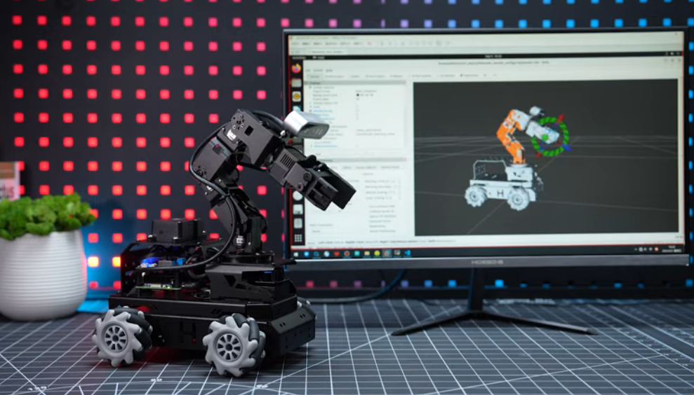

# LanderPi

English | [中文](https://github.com/Hiwonder/LanderPi/blob/main/README_cn.md)

<p align="center">
  
</p>

## LanderPi: Listens, Thinks, Acts! Your Robotics Learning & Development Platform

I've always wondered, what if a robot could truly understand when you say "bring me the red building block," then find it and plan the right moves all on its own? That's how LanderPi started: a robot platform that actually listens, thinks, and acts precisely. It's also a development platform where students, developers, and engineers can easily learn AI robotics and turn their own AI ideas into real projects.

<p align="center">
  
</p>

## Multimodal AI + ROS 2

LanderPi is built on ROS 2 and powered by multimodal AI large models. Just tell it what to do in natural language, and it handles the rest — from understanding the command and perceiving the scene, to planning a path and performing the task. Whether you ask it to "find the object next to the milk" or "pick the color block that appears the most," it gets what you mean and acts autonomously.

<p align="center">
  
</p>

### Hardware Built to Perform

LanderPi runs on a Raspberry Pi 5 + STM32 control system, packed with a 3D depth camera, a 6-DOF robotic arm, a TOF LiDAR, and an AI voice interaction module — giving it full perception capabilities. Oh, and about the chassis: take your pick — Ackermann chassis, Mecanum wheels or tank chassis. We've got you covered.

<p align="center">
  
</p>

<p align="center">
  
</p>

### High-Precision Mapping & Navigation

We equipped [LanderPi](https://www.hiwonder.com/products/landerpi) with a TOF LiDAR that scans and maps environments down to centimeter-level accuracy. Want it to navigate to specific points, run multi-stop routes, or patrol an area on its own? No problem! If an obstacle pops up out of nowhere, LanderPi senses it in real-time, dodges smoothly, and recalculates the route automatically. Even in complex environments, LanderPi autonomously moves with confidence.

<p align="center">
  
</p>

### 3D Vision for Smart Grasping

LanderPi's high-precision 3D camera detects an object's color, position, and distance. Mounted at the end of the robotic arm and paired with our inverse kinematics solutions, it delivers true hand-eye coordination. No matter how messy the layout, LanderPi identifies targets and picks them up with precision.

<p align="center">
  
</p>

### Talk to Your Robot with AI

With multimodal AI large models, LanderPi doesn't just hear you — it understands the situation. Whether you say something simple like "hand me that red thing" or something trickier like "find the largest of all the blue objects," it translates your words into action — and figures out how to execute on its own.

<p align="center">
  
</p>

### YOLOv11 for AI Vision

Powered by a YOLOv11 deep learning model, LanderPi doesn't just see objects — it recognizes and classifies them. Combined with the 3D vision system, it doesn't just see — it understands, bringing true visual intelligence to every task.

<p align="center">
  
</p>

## Fully Open Source, Free to Take

Code sources are open — robot control, AI interaction, 3D vision, robotic arm control ... all here on GitHub. Use the existing modules as they are, or develop your own features on top of our framework. If you're excited to tinker with a robot that listens, thinks for itself, precisely acts — you're in the right place. We've also built full [LanderPi tutorials](https://www.hiwonder.com.cn/store/learn/180.html) and docs to help you. Just learn and develop it! Let's make robots cooler together.

<p align="center">
  
</p>

## Official Resources

### Official Hiwonder
- **Official Website**: [https://www.hiwonder.com/](https://www.hiwonder.com/)
- **Product Page**: [https://www.hiwonder.com/products/landerpi](https://www.hiwonder.com/products/landerpi)
- **Official Documentation**: [https://docs.hiwonder.com/projects/LanderPi/en/latest/](https://docs.hiwonder.com/projects/LanderPi/en/latest/)
- **Technical Support**: support@hiwonder.com

## Project Structure

```
landerpi/
├── src/                    # Source code modules
├── command                 # Command reference and utilities
└── sources/                # Resources and documentation
    └── images/             # Product images and media
```

## Version Information
- **Current Version**: LanderPi v1.0.0
- **Supported Platform**: Raspberry Pi 5

### Related Technologies
- [ROS2](https://ros.org/) - Robot Operating System 2
- [MoveIt](https://moveit.ros.org/) - Motion Planning Framework
- [OpenCV](https://opencv.org/) - Computer Vision Library
- [YOLOv11](https://github.com/ultralytics/yolov11) - Object Detection Framework

---

**Note**: This program is pre-installed on the LanderPi robot system and can be run directly. For detailed tutorials, please refer to the [Official Documentation](https://docs.hiwonder.com/projects/LanderPi/en/latest/).
