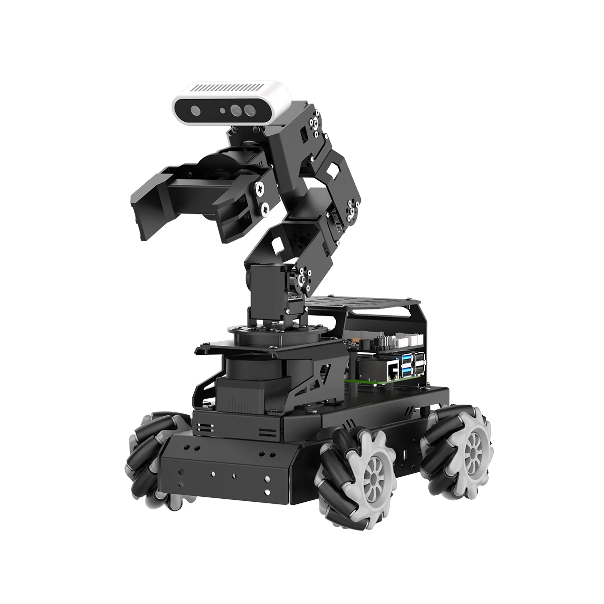

# LanderPi

English | [中文](https://github.com/Hiwonder/LanderPi/blob/main/README_cn.md)

<p align="center">
  
</p>

## Product Overview

LanderPi is a composite robot developed by Hiwonder for ROS education scenarios. It supports three chassis configurations: Mecanum wheels, Ackermann, and tank tracks. Integrated with Raspberry Pi 5, high-precision LiDAR, 3D depth cameras, 3D depth vision robotic arm, racing-grade tires and other high-performance components, it can achieve robot motion control, remote communication, SLAM mapping and navigation, path planning, dynamic obstacle avoidance, autonomous driving, gesture control, robotic arm MoveIt simulation, hand-eye coordination autonomous grasping, autonomous navigation and transportation, natural language interaction and other applications.

LanderPi also deploys multimodal AI large models. Combined with AI voice interaction box, it can understand the environment, plan actions and flexibly execute tasks, enabling more advanced embodied intelligence applications.

## Official Resources

### Official Hiwonder
- **Official Website**: [https://www.hiwonder.net/](https://www.hiwonder.net/)
- **Product Page**: [https://www.hiwonder.com/products/landerpi](https://www.hiwonder.com/products/landerpi)
- **Official Documentation**: [https://docs.hiwonder.com/projects/LanderPi/en/latest/](https://docs.hiwonder.com/projects/LanderPi/en/latest/)
- **Technical Support**: support@hiwonder.com

## Key Features

### AI Vision & Navigation
- **SLAM Mapping** - Real-time simultaneous localization and mapping
- **Path Planning** - Intelligent route planning and navigation
- **Dynamic Obstacle Avoidance** - Real-time obstacle detection and avoidance
- **Autonomous Driving** - Self-driving capabilities with advanced navigation
- **3D Depth Perception** - Stereo vision with depth camera integration

### Robotic Arm Integration
- **3D Depth Vision Robotic Arm** - Advanced manipulation capabilities
- **MoveIt Simulation** - Motion planning and control simulation
- **Hand-Eye Coordination** - Autonomous grasping with visual feedback
- **Autonomous Navigation and Transportation** - Pick and place operations

### Intelligent Control
- **Multi-Chassis Support** - Mecanum wheels, Ackermann, and tank tracks
- **Gesture Control** - Intuitive human-robot interaction
- **Remote Communication** - Wireless control and monitoring
- **Natural Language Interaction** - AI-powered voice commands
- **Multimodal AI Integration** - Advanced embodied intelligence

### Programming Interface
- **ROS2 Integration** - Full Robot Operating System 2 support
- **Python Programming** - Comprehensive Python SDK
- **AI Voice Interaction** - Natural language processing capabilities
- **Simulation Environment** - Complete development and testing platform

## Hardware Configuration
- **Processor**: Raspberry Pi 5
- **Operating System**: ROS2 compatible Linux
- **Vision System**: 3D depth camera + high-precision LiDAR
- **Manipulation**: 3D depth vision robotic arm
- **Chassis**: Supports three configurations: Mecanum wheels, Ackermann, and tank tracks
- **Tires**: Racing-grade high-performance tires
- **AI Integration**: Multimodal AI large models with voice interaction box

## Project Structure

```
landerpi/
├── src/                    # Source code modules
├── command                 # Command reference and utilities
└── sources/                # Resources and documentation
    └── images/             # Product images and media
```

## Version Information
- **Current Version**: LanderPi v1.0.0
- **Supported Platform**: Raspberry Pi 5

### Related Technologies
- [ROS2](https://ros.org/) - Robot Operating System 2
- [MoveIt](https://moveit.ros.org/) - Motion Planning Framework
- [OpenCV](https://opencv.org/) - Computer Vision Library
- [PCL](https://pointclouds.org/) - Point Cloud Library

---

**Note**: This program is pre-installed on the LanderPi robot system and can be run directly. For detailed tutorials, please refer to the [Official Documentation](https://docs.hiwonder.com/projects/LanderPi/en/latest/).